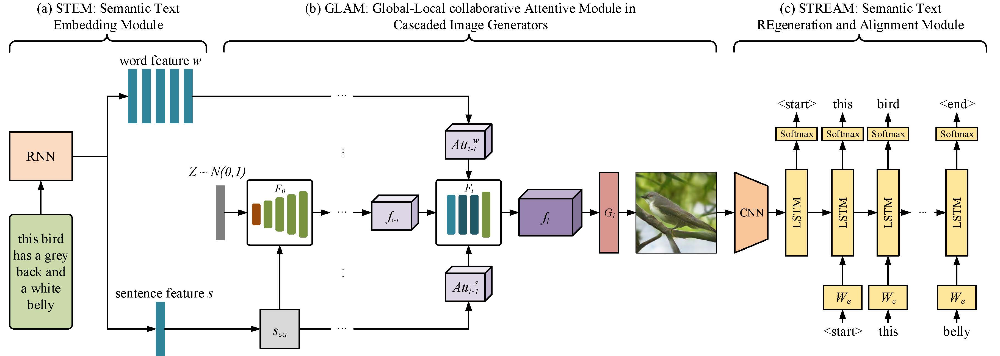

# Mirror-GAN
Mirror GAN implementation to perform text to image task. [Paper](https://arxiv.org/pdf/1903.05854.pdf)
## Summary of Model
+ STEM : This creates an RNN based embedding for the input text. Needs to be pretrained before hand. Update the cfg/train_dog.yml file to run `python pretrain_DAMSM.py`
+ GLAM : This consists of 3 GANs each increasing the resolution of the previous output out of which the last 2 contains AttnGAN based GANs for better outputs
+ STREAM : Basic Image Captioning Model. Needs to be pretrained. 
 

## Installation
+`pytorch >1.0.0`
+ `nltk`
+ `easydict`
+ `pandas`

## Results
+ Medium sized.white and brown coloured dog with a long snout and droopy ears  

+ Small black coated dog with drooping ears  

## References
Thanks to these repositories for help with implementation
+ [Image Captioning](https://github.com/yunjey/pytorch-tutorial/tree/master/tutorials/03-advanced/image_captioning)
+ [AttnGAN](https://github.com/taoxugit/AttnGAN)
+ [Original Implementation](https://github.com/qiaott/MirrorGAN)
